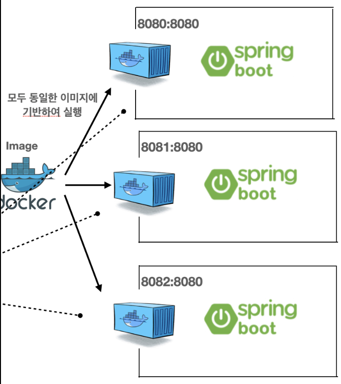
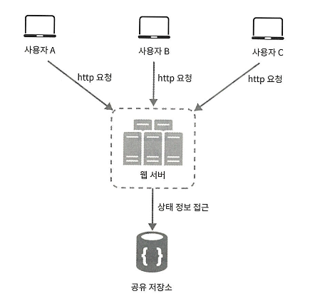
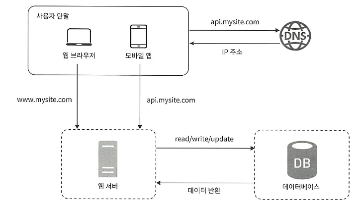

# 2주차(1) - 1장

태그: Study
진행도: 완료

> 사용자 요청 시 대략적인 처리 흐름을 정리해보자.
> 

1. 사용자는 도메인 이름을 이용해서 웹사이트에 접속한다. 이 접속을 위해서는 도메인 이름을 DNS에 질의하여 IP 주소로 변환하는 과정이 필요하다.
2. DNS 서버의 조회 결과로 IP 주소가 반환된다. 
3. 해당 IP 주소로 HTTP 요청이 웹 서버에 전달된다.
4. 요청을 받은 웹 서버는 HTML 페이지나 JSON 형태의 응답을 반환한다.

### **RDBMS**

- RDBMS는 R의 의미인 관계(Relation)의 의미대로 관계형 데이터 모델을 기초로 두고 모든 데이터를 테이블 형태로 표현하는 데이터베이스이다.
- RDBMS에는 아래와 같은 2가지 특징이 있다.
    - 데이터는 정해진 데이터 스키마에 따라 테이블에 저장된다.
    - 데이터는 관계를 통해 여러 테이블에 분산된다.
- 테이블은 명확하게 정의된 구조가 있어서 스키마 구조에 맞는 데이터만 추가 할 수 있다.
- 관계형 데이터베이스에서 관계는 기본키와 외래키를 통해 관계를 표현된다.

### NoSQL

- RDBMS와 다르게 스키마리스한 DB이다.
- JOIN 이라는 개념이 존재하지 않는다.

아래의 경우 NoSQL 사용을 고려해볼 수 있다.

- 아주 낮은 능답 지연시간(latency)이 요구될 경우
- 다루는 데이터가 비정형(unstructured)이라 관계형 데이터가 아닐 경우
- 데이터(JSON, YMAL, XML 등)를 직렬화하거나 역직렬화 할 수 있기만 하면 될 경우
- 아주 많은 양의 데이터를 저장할 필요가 있을 경우 (NoSQL은 Scale-out을 쉽게 할 수 있다는 장점이 있다.)

## Scale-Up vs Scale Out

> 서버 아키텍처를 구상해봤다면 항상 고민하게 되는 지점으로, 전자(스케일 업)는 서버에 CPU, 메모리와 같은 고사양 자원을 추가하는 행위를 말하고, 후자는 더 많은 서버를 추가하여 성능 개선하는 행위를 말한다.
> 

스케일 업은 늘 아래와 같은 고민들에 부딫히게 된다. 

- 한 대의 서버에 CPU나 메모리를 무한정 증설할 방법은 없으며 비용도 기하급수적으로 증가하게 된다.
- 수직적 규모 확장법은 수평적 규모확장과 다르게 장애에 대한 자동복구 방안이나 다중화 방안을 제시하지 않는다.

## Load Balancing

사용자는 서비스를 이용하기 위해 로드밸런서의 공개 IP(Public IP)로 접속하면 로드밸런서는 서버간 통신에 사설 IP(Private IP)를 이용하며 요청을 처리하게 된다.

실제로 구현했었던 서비스에서도 위 그림과 비슷하게 구현을 했던 경험이 있다. 

첫 서비스 배포 직전 스케일 업과 아웃을 고민하였고, 사용자 수 예측이 힘들었기에 두가지 방식 모두를 택하였다. 개발 환경에서는 메모리 스왑을 통해 VM 늘려주는 것 정도로도 운용이 가능했지만, 6개의 Docker 컨테이너만 해도 상당한 용량을 차지하고 있었기에, 우선 스케일 업을 진행하였다. 

그 다음은 스케일 아웃을 위해 로드 밸런싱을 구축하고자 하였다. 앞서 말했듯이 사용자 예측이 힘들었기에, 최소한의 비용으로 트래픽 분산 정도로만 목표로 삼았었다. AWS 의존도를 줄이기 위해 ELB 대신 리버스 프록시로 사용중이었던 Nginx 를 택하였다. 

Nginx 컨테이너를 최전방에 배치하여 로드밸런서로 활용하였고, 복제된 3개의 WAS 컨테이너에 동일한 IP(디바이스)이거나, 캐싱처리한 리프레시 토큰을 통해 같은 요청들은 하나의 컨테이너로 향하도록 하였고, Nginx 가 이 트래픽들을 라운드 로빈 방식으로 적절히 분산시키도록 하였다. 또한, 주기적인 헬스체킹을 통해 하나의 컨테이너가 다운되어도, 자연스럽게 다른 컨테이너로 트래픽이 옮겨가도록 설정하였다. 

## DB 다중화

데이터베이스의 다중화는 보통 서버 사이에 주(Master)-부(Slave) 관계를 설정하고 원본은 Master서버에, 사본은 Slave 서버에 저장하는 방식을 운영한다.

이때 `쓰기(데이터 변경)`에 대한 요청은 `Master`에서만 처리하고 `Slave`는 Master로부터 전달받은 사본을 통해 `Read 연산을 지원`한다. 이러한 구조는 이유는 대부분의 애플리케이션은 읽기 연산의 비중이 쓰기 연산보다 높다는 특성을 이용해 Master보다 Slave를 더 증축하기 위해 고안되었다.

따라서, Master-Slave 모델에서 모든 데이터의 변경 요청은 Master에서 처리하고 조회는 N대의 Slave에 분산되어 병렬로 처리되게 되므로 성능 개선을 기대할 수 있다. 

Master-Slave에서 장애가 발생했을 때의 동작은 아래와 같다.

> Slave 데이터베이스에 장애가 발생할 경우
> 
> - Slave 데이터베이스가 1개일 경우 : 새로운 Slave 데이터베이스가 만들어지기 전까지 읽기 연산이 모두 Master로 전달되게 된다.
> - Slave 데이터베이스가 여러개일 경우 : 읽기 연산은 나머지 Slave들로 분산되어 처리될 것이다.

> Master 데이터베이스에 장애가 발생할 경우
> 
> - Slave 데이터베이스가 1개일 경우 : Slave가 Master로 승격하고 모든 연산들이 해당 서버에서 수행된다. 그리고 새로운 Slave 서버가 추가되게 된다.
> - Slave 데이터베이스가 여러개일 경우 : Slave 중 한 대가 Master로 승격하여 동작한다.

## Cache

캐시 계층(Cache Tier)은 데이터가 잠시 보관되는 계층으로 데이터베이스보다 훨씬 빠르다. 애플리케이션의 성능은 `DB를 얼마나 자주 호출하느냐(I/O)`에 따라 크게 좌우되는데, 값비싼 연산 결과 또는 자주 참조되는 데이터를 캐싱하므로써 이런 문제를 완화해주며 성능 개선의 효과까지 얻을 수 있다. 독립적인 확장 또한 가능하다.  

> 요청을 받은 웹 서버는 캐시를 확인
⇒ 값이 있다면 해당 데이터를 반환 
⇒ 값이 없다면 DB 조회를 통해 캐시에 저장한 후 데이터를 반환
> 

캐시 사용 시에는 아래와 같은 포인트들을 생각해봐야 한다. 

- 캐시 데이터는 서버 재부팅과 같은 상황에서 휘발 되기에, 영속이 필요한 상황에는 맞지 않다.
- 저장소의 원본을 갱신하는 연산과 캐시를 갱신하는 연산이 단일 트랜잭션으로 처리되지 않는 경우, 데이터 저장소의 원본과 캐시 내부의 사본의 일관성이 사라질 수 있다.
- 캐싱된 데이터의 만료 시점은 언제로 할 것인가? 만료 기간은 너무 길면 원본과 차이가 날 수 있고, 짧으면 데이터베이스의 접근이 많아질 수 있어 적절한 값을 설정해야 한다.

### CDN

CDN은 정적 콘텐츠를 전송하는데 쓰이는, 지리적으로 분산된 서버의 네트워크로 이미지, 비디오, CSS, JavaScript 파일 등을 캐시할 수 있으며,  request path, query string, cookie, request header 등의 정보에 기반하여 HTML 페이지를 캐싱하게 된다.

동작 방식은 사용자가 웹 사이트에 방문하면, 그 사용자로부터 가까운 CDN서버가 정적 콘텐츠를 전달하게 된다. 만약 해당 CDN 서버로부터 원하는 데이터가 없다면 원본(origin) 서버로부터 데이터를 가져와 CDN 서버에 저장한 후, 다시 반환하는 방식으로 동작하게 된다.

> 원본 서버가 CDN 서버에 데이터를 응답할 때는 Header에 데이터를 캐싱할 수 기간인 TTL를 넘겨주어 CDN은 TTL이 끝날 때까지 데이터를 캐시하게 된다.
> 

## ScaleOut - 무상태(Stateless) 웹 계층

수평적 확장을 위해서는 사용자 세선 데이터와 같은 상태 정보를 웹 계층에서 제거해야 한다.

상태 정보를 저장하는 Stateful한 서버에서의 클라이언트의 요청은 같은 서버로 전송되어야 하여 로드밸런서를 통한 고정 세션(Sticky session) 기능을 통해 처리할 수 있다. 하지만 이는 로드밸런서의 부담을 주고 웹 계층의 
서버를 증설하거나 제거하기도 까다로워진다는 문제와 장애를 처리하기 복잡하다는 문제들이 존재한다.

Stateless한 서버를 만드는 바람직한 전략은 상태 정보를 RDBMS나 NoSQL 또는 Redis와 같은 캐시 시스템과 같은 공유 저장소에 물리적으로 분리하여 보관하고 필요할 때 가져오는 것이다. 

## **시스템 컴포넌트의 분리를 위한 메시지 큐**

메시지 큐는 메시지의 무손실를 보장하며 비동기 통신을 지원하는 컴포넌트로, 메시지의 버퍼 역할을 담당 한다. 
동작은 크게 생성자가 메시지를 만들어 발행하면 큐에는 보통 구독자가 메시지를 받아 그에 맞는 동작을 수행하는 구조로 수행된다. 

메시지 큐를 이용하면 서비스 또는 서버 간 결합이 느슨해져, 규모 확장성이 보장되어야 하는 안정적 애플리케이션을 구성하기 좋다.

- 생산자와 소비자는 서로 간 서버 상태에 상관 없이 메시지의 발행과 소모가 가능하다.
- 큐의 대기열에 쌓이는 메시지 양에 따라, 메시지를 처리하는 Worker 프로세스(Consumer)의 양을 늘리거나 줄이며 생산자와 소비자 서비스 규모를 독립적으로 관리할 수 있다.