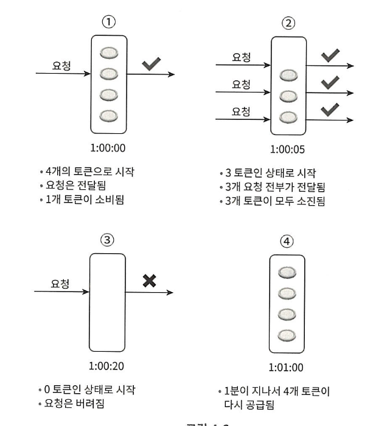

# 2주차(2) - 4장 처리율 제한 장치 설계

태그: Study
진행도: 완료

## 처리율 제한 장치(Rate Limiter)

클라이언트 또는 서비스가 보내는 트래픽의 처리율(Rate)를 제어하기 위한 장치이다.

이를 통해 특정 기간 내에 전송되는 클라이언트의 요청 수를 제한할 수 있다. 제한 기준은 상황에 따라 여러 기준을 정할 수 있는데, API별로 요청 횟수를 제한한다면 정의된 임계치를 넘어서면 추가적으로 들어오는 요청들은 처리가 중단(block)되게 된다.

> 책에서의 Rate Limiter 를 적용한 예시들은 아래와 같다.
> 
- 사용자는 초당 2회 이상의 새 글을 올릴 수 없다.
- 같은 IP 주소로는 하루에 10개 이상의 계정을 생성할 수 없다.
- 같은 디바이스로는 주당 5회 이상 리워드를 요청할 수 없다.

이를 통해, DoS(Denail of Service) 공격에 의한 자원 고갈을 방지할 수 있다. 구글, 트위터 등 대형 IT 기업들에서 공개한 대부분의 API들은 처리율 제한 장치를 갖고 있어 DoS 공격을 방지한다.

또한, 비용을 절감할 수 있다. 추가 요청에 대한 처리를 제한하며 서버를 많이 두지 않아도 되고, 우선 순위가 높은 API에 더 많은 자원을 할당할 수 있다. 따라서, 서버의 과부하를 막을 수 있다. 트래픽이나 사용자의 잘못된 이용 패턴으로 유발된 트래픽을 처리율 제한 장치로 걸러낼 수 있다.

### 그러면, 어디에 위치시켜야 할까?

**서버**에 둘 수도 있고 **클라이언트 측**에 둘 수도 있다. 하지만 클라이언트에 위치하는 것은 클라이언트 요청은 쉽게 위변조 및 탈취가 가능하기에 일반적으로 안정적으로 걸 수 있는 방법이 아니다.

서버에 직접적으로 위치시키는 방법 외에도 처리율 제한 미들웨어(middleware)를 만들어 서버로 가는 요청을 통제하는 방법도 존재한다.

클라우드 마이크로서비스의 경우, 처리율 제한 장치는 보통 `API 게이트웨이(gateway)`라고 불리는 컴포넌트에 구현된다. 이는 처리율 제한, SSL 종단(termination), 사용자 인증(authentication), IP 허용 목록 관리 등을 지원하는 완전 위탁 관리형(클라우드 업체가 유지보수를 담당하는) 서비스이다.

## 처리율 제한 알고리즘 4가지

### 1.  **토큰 버킷 (Token Bucket)**



토큰 버킷은 지정된 용량을 갖는 컨테이너를 이용해 처리율 제한을 한다. 버킷에는 토큰 공급률(refill rate)에 따라 토큰이 주기적으로 채워지며 버킷이 꽉 찰 경우에는 추가로 공급된 토큰은 버려진다.

동작은 요청이 도착하면 버킷에 충분한 토큰이 있는지 검사하고 충분한 토큰이 있으면 버킷에서 토큰을 하나 꺼낸 후, 요청을 시스템에 전달하게 된다. 반대로 토큰이 없을 경우에는 해당 요청은 버려지게 된다.

**[필요한 인자]**

- 버킷 크기 : 버킷에 담을 수 있는 토큰의 최대 개수
- 토큰 공급률(refill rate) : 초당 몇 개의 토큰이 버킷에 공급되는지

**[버킷 할당 방법]**

버킷은 통상적으로 API endpoint마다(기능별) 버킷을 둔다. 예를 들면 `하루에 한 번만 포스팅을 할 수가 있다`, `하루에 좋아요 버튼은 다섯 번 까지만 누를 수 있다.` 와 같은 상황이 있을 경우 사용자마다 2개의 버킷을 갖게 된다. 또한 IP주소별로 처리율을 제한할 경우 IP 주소마다 버킷을 두면 된다.

하지만 반대로 시스템의 전체 처리율을 제한할 경우에는 모든 요청이 하나의 버킷을 공유하도록 해야 한다.

### 2. **누출 버킷 알고리즘**


> 위의 토큰 버킷 알고리즘과 비슷하지만 요청 처리율이 고정되어 있다는 점이 다르며 보통 FIFO 큐로 구현.
> 

요청이 도착하면 큐가 가득차있는지 보고 빈자리가 있을 경우에는 큐에 요청을 추가한다. 하지만 큐가 가득 차 있을 경우 요청을 버리게 된다. 큐에 쌓인 요청은 지정된 시간마다 큐에서 꺼내어 처리한다.

### 3. **고정 윈도 카운터 알고리즘**


> 타임라인을 고정된 간격의 윈도우로 나누고, 각 윈도마다 CNT를 붙여준다. 그리고 요청이 접수될 때마다 CNT의 값을 1씩 증가시키는데 만약 카운터의 값이 임계치에 도달하면 새로운 요청은 새 윈도가 열릴 때까지 버려지게 된다.
> 

### 4. **이동 윈도 로깅 알고리즘**

- 타임스탬프(timestamp)를 추적하여 타임스템프 데이터를 보통 레디스(Redis)의 정렬 집합(sorted set)과 같은 캐시에 보관한다.
- 새 요청이 오면 현재 윈도의 시작 시점보다 오래된 만료된 타임스템프를 제거한다.
- 새 요청의 타임스탬프를 log에 추가한다.
- log의 크기가 허용치보다 같거나 작으면 요청을 시스템에 전달한다. 그렇지 않을 경우 처리를 거부한다.

## 예시 아키텍처


1. 클라이언트가 처리율 제한 미들웨어에게 요청을 보낸다.
2. 처리율 제한 미들웨어는 레디스의 지정 버킷에서 카운터를 가져와서 한도에 도달했는지 아닌지 검사한다.
    1. 만약 한도에 도달했으면 요청이 거부한다.
    2. 한도에 도달하지 않았으면 요청은 API 서버로 전달된다. (미들웨어는 카운터의 값을 증가시킨 후 다시 레디스에 저장한다.)
3. 처리율 제한 규칙을 만들어 디스크에 보관하고 작업 프로세스들은 수시로 규칙을 디스크에서 읽어 캐시에 저장한다.
4. 처리율 제한 미들웨어는 요청이 왔을 때 제한 규칙을 캐시에서, 요청의 타임스탬프는 레디스 캐시에서 가져오고 해당 값들을 기반으로 요청을 API 서버로 보낼지 에러를 보낼지 결정한다.

> 그러면, 카운터는 어디다가 보관할까?
> 
- DB는 디스크 접근 때문에 느려서 사용할 수가 없고 메모리상에서 동작하는 캐시가 바람직하다. 뿐만 아니라 캐시는 시간에 기반한 만료 정책을 지원하여 더더욱 적합하다.
- 대표적으로는 레디스를 사용하는데, 레디스는 메모리에 저장된 카운터 값을 증가시키는 `INCR` 명령어와 카운터의 타임아웃 값을 설정하는 `EXPIRE` 명령어를 지원한다. (설정 시간이 지나면 카운터는 자동으로 삭제된다.)

> 처리율 제한 규칙
> 

```java
// 마케팅 메시지의 최대치를 하루 5개로 제한  
domain: messaging
descriptions:
    key: message_type
    Value: marketing
    rate_limit:
        unit: day
        requester_per_unit: 5
```

> 처리율 한도 초과 트래픽 처리
> 

요청이 한도 제한에 걸리면 API는 HTTP 429(Too Many Request)를 반환한다. 하지만 한도 제한에 대한 응답은 시스템 별로 메시지 큐에 남겨 응답을 나중에 보낼 수도 있고, 요청을 보관했다가 나중에 처리할 수도 있다.

> 분산 환경에서의 처리율 제한 장치 구현
> 


여러대의 서버와 병렬 스레드를 지원하도록 시스템을 확장하는 것은 경쟁 조건(Race Condition)과 동기화(Synchronization)문제를 해결해야 한다.

**Race Condition**

- 두 개의 스레드가 레디스에서 카운터의 값을 변경하는 과정을 동시에 진행할 경우 발생할 수 있다.
- 해결 방법으로는 먼저 Lock을 거는 방법이 있는데, 이는 시스템의 성능을 상당히 떨어뜨릴 수 있다. 그래서 더 나은 방법으로 루아스크립트(Lua Script) 또는 레디스의 정렬 집합(Sorted set)을 사용하는 방법을 사용할 수도 있다.

**Synchronization**

- 여러 사용자를 지원하기 위해 여러 대의 처리율 제한 장치 서버를 둔다면 동기화가 필요해진다. (서버들은 Stateless한 상태라 클라이언트가 요청 별로 다른 서버로 보낼 수 있어서 사용자별로 버킷을 두는 처리율 제한 장치들은 올바르게 수행하지 못할 수 있다.)
- 해결 방법으로는 고정 세션(Sticky Session)을 사용하여 같은 클라이언트는 같은 서버로 요청을 보내는 방법이 있으나 해당 방법은 확장 가능하지도 않고 유연하지도 않다. 그래서 더 나은 방법으로 레디스와 같은 중앙 집중형 데이터 저장소를 써서 해결하는 것이 좋다.

### 디벨롭 중인 내 서비스에도 적용이 가능할까?

[[Nginx RateLimit] Nginx에 RateLimit 적용해보기](https://willseungh0.tistory.com/191)

우선, Nginx 에 RateLimit 과 관련된 기능이 있음을 알게 되었다. 

### Nginx

```java
limit_req_zone $binary_remote_addr zone=req_limit_per_ip:10m rate=5r/s;

server {
  location /api/ {
    limit_req zone=req_limit_per_ip burst=10 nodelay;
    proxy_pass http://backend;
  }
}
```

IP당 초당 5건 요청 허용을 허용시켰고, burst 10 은 순간적인 트래픽 허용량을 말한다. Nginx 에서

위와 같이 적용을 해준다면, WAS 서버의 부하를 직접적으로 줄여줄 수 있게 된다. 

## Spring + Redis

전체적인 흐름은 다음과 같다. 

`사용자 요청` → `Spring Interceptor / Filter` → `Redis 요청 횟수, TTL 저장` → `허용 여부 판단`

→ `요청 처리 or 429 응답`

Redis Key 설정

```java
rate-limit:user:{userId}
rate-limit:ip:{ip}
```

```java
public boolean isAllowed(String userId) {
    String key = "rate-limit:user:" + userId;
    Long count = redisTemplate.opsForValue().increment(key);

    if (count == 1) {
        // 최초 요청 시 TTL 설정
        redisTemplate.expire(key, Duration.ofMinutes(1));
    }

    return count <= 5;
}
```

요청 횟수 초과임을 판단하는 메서드를 만들어주었다. 

```java
@GetMapping("/resource")
public ResponseEntity<?> handle(@AuthenticationPrincipal UserPrincipal user) {
    if (!rateLimitService.isAllowed(user.getId())) {
        return ResponseEntity.status(429).body("요청이 너무 많습니다.");
    }

    return ResponseEntity.ok("정상 응답입니다.");
}
```

이런 식으로 활용할 수 있겠다.