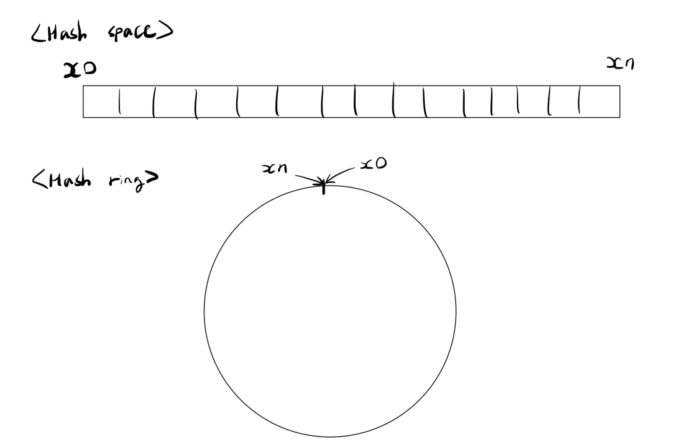

# 3주차 - 5장 안정 해시 설계

태그: Study
진행도: 완료

<aside>
❔

안정 해시(consistent hash) 란? 

</aside>

**Scale Out**을 하기 위해서는 요청 또는 데이터를 N개의 서버에 균등하게 나누는 것이 중요한데, `안정 해시`는 균등한 분배를 달성하기 위해 보편적으로 사용하는 기술이다. 

해당 기술은 바로 아래 해시 키 재배치(refresh) 문제를 해결하기 위해 고안된 기술이다.

### 해시 키 재배치(refresh) 문제

N개의 서버에 부하를 균등하게 나누는 보편적인 방법은 `serverIndex = hash(key) % 서버의 개수 N` 해시 함수를 사용하는 것이다. 예를 들어 서버가 3대 있을 때, `hash(key) % 3`의 결과로 0, 1, 2 중 하나가 나오고, 각 값은 하나의 서버를 의미한다.

해당 방식은 서버 풀(Server pool)의 크기가 고정되어 있을 때와 데이터 분포가 균등할 때 잘 동작한다. 
하지만 서버가 추가되거나 삭제되면 키의 재분배가 필요해진다. 

서버 수가 바뀌면 `hash(key) % n`의 결과가 대부분 바뀌기 때문에, 거의 모든 키가 다른 서버로 이동하게 되는데, 이로 인해 기존 서버의 캐시를 활용하지 못하는 **대규모의 캐시 미스(Cache Miss)** 발생한다. 이는 성능 저하, 트래픽 급증으로 이어질 수 있다. 

<aside>
❔

그래서 안정 해시(consistent hash) 를 왜 사용하는걸까? 

</aside>

전통적인 해시 테이블은 슬롯의 수가 바뀌면 대부분의 키를 재배치하는 반면에 ,안정 해시(consistent hash)는 해시 테이블 크기가 조정될 때 평균적으로 오직 `(k/n)개의 키`만 재배치하는 해시 기술이다. (k는 키의 개수, n은 슬롯의 개수)

[특징]

- 해시 공간을 **원형 링(Circle)** 구조로 표현
- 키와 서버를 모두 같은 해시 공간에 매핑
- 키는 **자신보다 가까운 시계 방향 상의 서버**에 할당
- 서버 추가/삭제 시 **일부 키만 재배치**됨

[장점] 

- 전체 키 중 **일부만 재분배**되므로 캐시 미스를 최소화
- 서버 증설/축소에 유연하게 대응 가능

[단점/한계점] 

- 밑에서 다룰 예정

### 해시 공간(Hash Space)과 해시 링(Hash Ring)



해시를 사용하게 된다면 사용하는 해시 함수에 따라 만들어질 수 있는 범위가 만들어진다. 이를 **해시 공간(hash space)** 이라고 한다.

안정 해시는 이러한 해시 공간을 원처럼 말아서 원형 큐(Circular Queue)와 같은 형태로 링을 만들어 사용한다. 이를 **해시 링(hash ring)** 이라고 한다.

### 해시 서버(Hash Server)


해시 서버는 서버들을 해시 함수에 서버의 IP나 이름을 대입해 해시 링 위에 위치시킨 것을 말합니다.  


안정 해시에서 사용하는 해시 함수는 나머지(modular)연산을 사용하지 않으며, 키는 링 위에 모든 지점에 배치가
가능합니다. 

[키 배치 방식] 

- **키는 링을 따라 시계 방향으로 탐색**하여 **처음 만나는 서버에 저장**됩니다.
- 즉, 어떤 키든 항상 자신보다 오른쪽(시계 방향)에 있는 가장 가까운 서버에 저장됩니다.
- 서버가 추가되면, 그 서버 앞에 있던 키들 일부만 새 서버로 이동되므로 재배치가 **국소적으로** 발생합니다.

하지만 해당 방법에는 서버가 추가되거나 삭제되는 상황을 고려했을 때 **파티션(partition)의 크기를 균등하게 유지하는게 불가능하다**는 문제가 있다. 자세히 설명하면 초기에 서버를 균등하게 위치시켰다 하더라도 중간에 서버를 추가하거나 삭제를 하면 특정 서버들은 할당받을 수 있는 키의 범위(해시 공간)이 다른 서버들과 비교하였을 때, 작거나 많아질 수 있는 문제가 발생하는 것이다.

또한 **키의 균등 분포를 달성하기가 어렵다**는 문제도 존재한다. `해시 키 & 서버` 에서 보였던 사진만 살펴봐도 S3서버는 어떠한 키도 분배받지 못한 반면에 S1서버는 2개의 키를 저장하고 있는 것을 확인할 수 있다.

### 가상 노드

가상 노드(virtual node)는 위의 안정 해시 구현법의 문제를 해결하기 위해 제안된 방법이다.

가상 노드는 실제 노드 또는 서버를 가리키는 노드로, 하나의 서버는 링 위에 여러 개의 가상 노드를 가질 수 있다. 이와 같이 각 각의 서버들은 여러 개의 가상 노드를 갖고, 각 각의 가상 노드가 갖는 여러 개의 파티션들을 관리하게 된다.

가상 노드의 개수를 늘리면 늘릴 수록 표준 편차가 작아져서 키의 분포는 점점 더 균등해진다. 하지만 가상 노드 데이터를 저장할 공간이 점점 더 많이 필요해진다는 tradeoff 한 문제가 있어 시스템 요구사항에 맞게 적절한 개수를 정해야 한다.

<aside>
❔

안정 해시 기법을 실제 백엔드 개발에서 어떻게 쓰일까?

</aside>

1. **분산 캐시 시스템**
- 다수의 캐시 서버에 데이터를 균등 분산
- 서버를 추가/제거할 때 대부분의 캐시 데이터를 그대로 유지하기 위함 ⇒ 캐시 적중률 유지

⇒ 식별 값(user_id)를 해시 함수를 통해 해시 링에 매핑 

1. **DB 샤딩** 
- 단일 DB의 부하를 분산하고 데이터 저장 용량을 확장하기 위함

⇒ 마찬가지로 식별 값으로 각 샤드(DB 인스턴스)를 해시 링에 매핑하여 특정 데이터가 어느 샤드에 속할지 결정

1. **로드 밸런싱**
- 같은 사용자의 요청을 항상 같은 서버로 보내 세션 상태를 유지
- 클라이언트 식별자 (IP, 세션 토큰 등)를 해싱 → 해시 링에서 가장 가까운 서버로 요청 라우팅
- 서버 인스턴스가 증가/감소해도 대부분의 사용자 요청은 기존 서버로 유지

[예시]

> 완전한 해시 링 구현은 아니지만, 거의 개념적으로 유사
> 

```java
// nginx.conf 

upstream backend_servers {
    ip_hash;     // 클라이언트 IP 기준으로 고정된 서버에 연결

    server 192.168.0.101:8080;
    server 192.168.0.102:8080;
    server 192.168.0.103:8080;
}

server {
    listen 80;

    location / {
        proxy_pass http://backend_servers;
        proxy_set_header Host $host;
        proxy_set_header X-Real-IP $remote_addr;
    }
}

```

1. **Kafka 파티셔닝을 이용한 로그 분산 수집** 
- 동일한 로그 키(사용자, 디바이스 등)를 항상 같은 파티션에 저장하기 위함
- 로그의 특정 키 필드를 해싱하여 해시 링에 매핑, 시계 방향으로 가장 가까운 Kafka 파티션에 할당

> Kafka는 **"같은 파티션 내의 메시지 순서"만 보장하므로,** 순서를 유지하려는 메시지(ex_특정 사용자 이벤트)는 **같은 파티션에 들어가도록 동일 키로 전송**해야 한다.
> 

```java
// Key 기반의 해싱
producer.send(new ProducerRecord<>("topic", key, value));
```

> Producer 구현 예시 (Event 발행)
> 

```java
@Service
@RequiredArgsConstructor
public class UserEventProducer {

    private final KafkaTemplate<String, String> kafkaTemplate;
    private static final String TOPIC_NAME = "user_events";

    public void sendUserEvent(String userId, String eventJson) {
        // 동일 userId는 항상 같은 파티션으로 전송됨 → 순서 보장 가능
        kafkaTemplate.send(TOPIC_NAME, userId, eventJson);
    }
}

```

> Consumer 구현 예시  (Event 구독)
> 

```java
@Slf4j
@Component
public class UserEventConsumer {

    @KafkaListener(topics = "user_events", groupId = "user_event_group")
    public void consume(ConsumerRecord<String, String> record) {
        String userId = record.key();
        String payload = record.value();
        int partition = record.partition();
        
        log.info("수신된 이벤트, 사용자 ID: {}, 파티션: {}, 내용: {}", userId, partition, payload);
    }
}

```