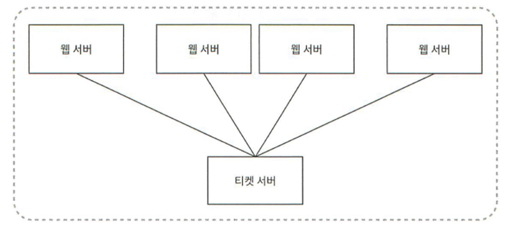

# 4주차 - 7장 분산 시스템을 위한 유일 ID 생성기 설계

태그: Study
진행도: 완료

## 분산 시스템에서 사용될 유일 ID 생성기를 설계하기

> `auto_increment` 속성이 설정된 관계형 DB의 PK는 분산 환경에서 사용하기에 적합하지 않다고 한다.
따라서, 시스템 설계에 앞서 요구사항을 정리해보자.
> 

### ID 생성기 요구조건

- ID는 유일해야 한다.
- ID는 숫자로만 구성되어야 한다.
- ID는 64비트로 표현될 수 있는 값이어야 한다.
- ID는 발급 날짜에 따라 정렬 가능해야 한다.
- 초당 10,000개의 ID를 만들 수 있어야 한다.

<aside>
💡

분산 시스템에서 유일성이 보장되는 ID를 만드는 방법들은 아래와 같다. 

</aside>

1. **다중 마스터 복제** (Multi-master replication)

다중 마스터 복제는 데이터베이스의 `auto_increment`를 활용하는 방법이다. 
다만 ID의 값을 구할 때 1만큼 증가시키는 것이 아닌, **DB 서버 수인 K만큼 증가**시키며 **ID의 중복을 막는다.**

하지만 해당 방법은 아래의 단점이 존재한다.

- 여러 데이터 센터에 걸쳐 규모를 늘리기 어렵다.
- ID의 유일성은 보장되지만 시간 흐름에 따라 맞추어 커지도록 보장할 수는 없다.
- 서버를 추가하거나 삭제할 때도 잘 동작하도록 만들기 어렵다.

1. **UUID** (Universary Unique Identifier)

**UUID**는 시스템에 저장되는 정보를 유일하게 식별하기 위한 128비트 숫자값이다. UUID는 중복된 숫자가 발생할 확률이 희박하다.

UUID를 통한 ID 설정은 각각의 웹 서버에서 별도의 ID 생성기를 사용해 독립적으로 만들게 되므로, 서버 사이의 조율과 동기화 이슈가 없어 단순하며, 각 서버별로 ID 생성기를 두어 규모 확장이 쉽다.

하지만, 길이가 길다는 점과 시간순 정렬이 불가하다는 점, 숫자가 아닌 값이 포함될 수 있다는 단점들이 존재한다.
ex)  f2195bf4-4eb1-11ed-bdc3-0242ac120002

1. **티켓 서버** (Ticket Server) 

티켓 서버는 `auto_increment` 기능을 갖춘  DB 티켓 서버를 중앙 집중형으로 하나만 사용하며, 요청이 오면 ID를 웹 서버들에게 제공해주는 방법이다. 해당 방법은 중소 규모의 애플리케이션에 적합하다.

여기서 티켓 서버는 티켓팅 수량 감소 로직, 좌석 배정 등과 같은 **공유 자원에 대한 동시성 제어를 위한 서비스**에서 주로 이용된다고 한다. 

Nginx 와 같이 혼자서 모든 요청을 처리하기에, **`단일 장애 지점`**(SPOF, Single-Point-of-Failure)가 될 수 있다

따라서 단순히 티켓 서버 여러 대를 준비하는 것을 해결책으로 제시할 수 있는데, 이는 데이터 동기화 같은 이슈가 발생 할 수 있다. 

아래의 해결책을 살펴보자. 

<aside>
💡

**[ 이중화 or 클러스터링 ]** 

티켓 서버를 **2대 이상으로 구성하고, 클러스터링**을 통해 하나가 장애 발생 시 다른 서버가 자동으로 대응

**1. 이중화** 
: 핵심 구성 요소(서버, 네트워크, 스토리지 등)를 **복제하여 1개 이상 예비 자원을 준비**해두고, 장애 발생 시 이를 **자동 또는 수동으로 전환하는 구조**

- Active-Standby: 하나는 운영, 하나는 대기 후 자동 전환 (failover)
- Active-Active: 두 서버 모두 동시 운영, 로드 분산 + 장애 시 자동 전환

> Nginx + Keepalived, RDS Multi-AZ
> 

2. **클러스터링**
: 여러 대의 서버를 **논리적으로 하나의 시스템처럼 동작하도록 묶어**, **부하 분산**과 장애 허용(fault tolerance)을 동시에 달성하는 구조

> Kafka, Redis Cluster, Kubernetes
> 

따라서, **SPOF 방지**를 위해서는 최소한 **이중화 구성**이 필수이고, 트래픽 증가/확장성까지 고려한다면 
클러스터링이 이상적이다. 

</aside>

1. **트위터 스노플레이크(twitter snowflake) ID 생성 기법**

> 해당 방식은, 앞서 살펴봤던 모두 요구사항을 만족할 수 있다고 한다.
> 
> 
> 
> 

> 총 64비트의 ID의 구조를 사인 비트, 타임스탬프, 데이터센터 Id, 서버 ID, 일련번호의 구성으로 ID를 5개의 섹션으로 구분한다.
> 
- **사인(Sign) 비트**
    - 1비트를 할당한다.
- **타임스탬프(timestamp)**
    - 41비트를 할당한다.
    - epoch 이후로 몇 ms 가 경과했는지 나타내는 값이다.
    - 타임스템프 덕분에 시간 순으로 정렬이 가능해진다.
- **데이터센터 ID**
    - 5비트를 할당한다. (2^5개의 데이터 센터를 지원할 수 있다.)
- **서버 ID**
    - 5비트를 할당한다. (데이터센터당 2^5개의 서버를 지원할 수 있다.)
- **일련번호**
    - 12비트를 할당한다.
    - 각 서버에서는 ID를 생성할 때마다 일련번호를 1씩 증가하며 1밀리초가 경과할 때마다 0으로 초기화한다.

<aside>
💡

앞서 살펴본 `Snow Flake` 기법을 사용해서, ID 생성기로 타임 스탬프 섹션을 만들어보자. 

앞서 살펴본 ID 구조에서 가장 중요한 41비트를 차지하고 있다. 타임스탬프는 시간이 흐름에 따라 점점 큰 값을 갖게 되므로, 결국 아이디는 시간순으로 정렬 가능하게 된다.

[ 이진 표현 형태로부터 UTC 시각을 추출하는 예제 ]

</aside>