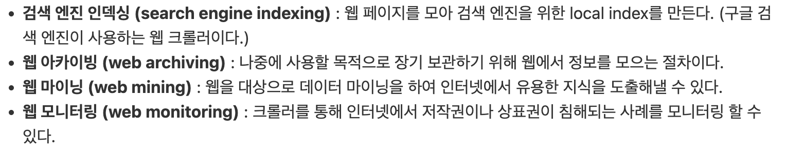

# 4주차 - 9장 웹 크롤러 설계

태그: Study
진행도: 완료

<aside>
💡

**웹 크롤러 ?** 

검색 엔진에서 널리 쓰이는 기술로, 웹에 새로 올라오거나 갱신된 콘텐츠(웹 페이지, 이미지 비디오 등)를 찾아내는 것이 주된 목적으로 고안된 기술이다. 

웹 크롤러의 복잡도는 처리해야 하는 **데이터의 규모** 에 따라 달라지니, 크롤러 설계 시 이에 맞춰 설계가 들어가야 한다. 

[사용 예시] 

</aside>

### 좋은 웹 크롤러가 만족시켜야 할 속성

- **규모 확장성** : 웹에 있는 데이터들은 너무 거대하여 병행성을 활용하면 효과적으로 웹 크롤링을 할 수 있다.
- **안정성(robustness)** : 웹에는 잘못된 HTML, 아무 반응 없는 서버, 장애, 악성 코드가 붙어있는 링크 등이 많아 이러한 환경에도 잘 대응할 수 있어야 한다.
- **예절(politeness)** : 크롤러는 수집 대상 웹 사이트에 짧은 시간동안 너무 많은 요청을 보내서는 안 된다.
- **확장성(extensibility)** : 기존의 크롤러에서 새로운 형태의 콘텐츠를 지원하기가 쉬워야 한다.

### 웹 크롤러 기본 알고리즘 동작

1. URL 집합이 입력으로 주어지면, 해당 URL들이 가리키는 모든 웹 페이지를 다운한다.
2. 다운받은 웹 페이지에서 **URL들을 추출**한다.
3. 추출된 URL들을 다운로드할 URL목록에 추가하고 과정을 반복한다.

> 설계를 시작해보자.
> 

### **1. 대략적 규모 측정**

- 조회 연산량
    - 매달 10억개의 웹 페이지를 다운로드한다.
    - QPS = 10억/30일/24시간/3600초 = 대략 400페이지/초
    - 최대(peak) QPS = 2 * QPS = 800
- 저장 용량
    - 웹 페이지의 크기 평균은 500k라고 가정
    - 10억 페이지 * 500k = 500TB/월
    - 1개월치 데이터를 보관하는 데는 500TB, 5년간 보관한다고 가정하면, 결국 500TB *12개월* 5년 = 30PB의 저장용량이 필요

### **2. 설계안**

1. 시작 URL들을 미수집 URL 저장소에 저장한다.
2. HTML 다운로더는 미수집 URL 저장소에서 URL 목록을 가져온다.
3. HTML 다운로더는 도메인 이름 변환기를 사용하여 URL의 IP 주소를 알아내고, 해당 IP 주소로 접속하여 웹 페이지를 다운받는다.
4. 콘텐츠 파서는 다운된 HTML 페이지를 파싱하여 올바른 형식을 갖춘 페이지인지 검증한다.
5. 콘텐츠 파싱과 검증이 끝나면 중복 콘텐츠인지 확인하는 절차를 개시한다.
6. 중복 콘텐츠인지 확인하기 위해 해당 페이지가 이미 저장소에 있는지 확인한다.
    1. 이미 저장소에 있으면 처리하지 않고 버린다.
    2. 저장소에 없으면 저장한 뒤 URL 추출기로 전달한다.
7. URL 추출기는 해당 HTML 페이지에서 링크를 골라낸다.
8. 골라낸 링크를 URL 필터로 전달한다.
9. 필터링이 끝나고 남은 URL만 중복 URL 판별 단계로 전달한다.
10. 이미 처리한 URL인지 확인하기 위하여, URL 저장소에 보관된 URL인지 살핀다. 만약 이미 저장소에 있으면 버린다.
11. 저장소에 없는 URL은 URL 저장소에 저장하고 미수집 URL저장소에도 전달한다.

### 2-1. 시작 URL 집합

웹 크롤러가 크롤링을 시작하는 출발점이다.

크롤러가 가능하면 많은 링크를 탐색할 수 있도록 URL을 고르는 것이 좋다. 일반적으로 전체 URL 공간을 나라별로 인기 있는 웹 사이트가 다르다는 점을 이용해 **작은 부분집합으로 나누는 전략**을 쓴다. 다른 방법으로는 주제별로 다른 시작 URL을 사용하는 전략이 있다.

### 2-2. 미수집 URL 저장소

대부분의 웹 크롤러는 크롤링 상태를 **다운로드할 URL**과 **다운로드된 URL**로 나누어 관리한다.

이 중에서 다운로드할 URL을 저장하고 관리하는 컴포넌트를 미수집 URL 저장소라고 한다. 이는 FIFO인 Queue로 구현되어있다.

미수집 URL 저장소를 활용하면 짧은 시간에 너무 많은 요청을 주지 않는 크롤러, URL 사이의 우선 순위와 신선도를 구별하는 크롤러를 구현할 수 있다.

- 웹사이트의 hostname과 다운로드를 수행하는 worker thread간의 관계를 유지하며 스레드별로 FIFO 큐를 갖게 하고 해당 큐에서 꺼낸 URL만 다운로드하도록 한다.
- 이때 큐 라우터(queue router)는 같은 host에 속한 URL은 항상 같은 큐로 보장한다. 이러한 구조 덕분에 여러 스레드에서 병렬적으로 동일한 host에 요청을 몰아주지 않아 예의를 갖춘 크롤러를 만들 수 있다.

### 2-3. HTML 다운로더

인터넷에서 **웹 페이지를 다운로드하는 컴포넌트**로, 미수집 URL 저장소에서 제공하는 URL을 통해 페이지를 다운로드한다.

HTML 다운로더의 성능 최적화를 위한 방법은 아래와 같다. 

1. **분산 크롤링**
    
    크롤링 작업을 여러 서버에 분산하는 방법이다. 또한 각각의 서버는 여러 스레드를 돌려 작업을 처리하여 성능이 향상된다.
    
2. **도메인 이름 변환 결과 캐싱**
    
    도메인 이름 변환기는 작업이 동기적으로 이루어져 크롤러의 성능 병목 지점이 된다. 
    따라서, DNS 조회 결과로 얻어진 데이터를 캐시에 보관하고 크론 잡(cron job) 등을 돌려 주기적으로 갱신하도록 하여 성능을 높일 수 있다.
    
3. 지역성
    
    크롤링 작업을 수행하는 서버가 대상 서버와 지역적으로 가까우면 다운로드 시간이 줄어드는 점을 이용해 서버를 지역별로 분산하는 방법이다.
    
4. **짧은 타임아웃**
    
    응답이 느리거나 아예 응답하지 않는 서버들도 존재하여 최대 대기 시간을 미리 설정해두어 일정 시간 응답하지 않으면 다음 페이지로 넘어가도록 동작한다.
    

다음으로, HTML 다운로더의 안정성 확보를 위한 방법은 아래와 같다. 

1. 안정해시를 서버들의 부하 분산에 적용
2. 장애가 발생하여도 쉽게 복구할 수 있게 지속적으로 크롤링 상태 및 수집 데이터를 저장한다.
3. 에러 처리를 통해 전체 시스템이 중단되는 일을 예방한다.
4. 오류를 방지하기 위해 데이터를 검증한다.

### 2-4. 도메인 이름 변환기 (DNS Resolver)

보통 URL에 접속할 때는 DNS를 통해 IP 주소로 변환하여 접근하게 된다. HTML 다운로더는 도메인 이름 변화기를 통해 **URL에 대응되는 IP주소**를 알아낸다.

### 2-5. 콘텐츠 파서

웹 페이지를 다운로드하면서 이상한 페이지를 걸러내기 위해 파싱(parsing)과 검증(validation) 절차를 거쳐야 한다. 서버 안에 파서를 구현할 경우 느려질 수 있기에 독립적인 컴포넌트로 만들었다.

### 2-6. 중복 컨텐츠 확인

연구 공개에 따르면 약 29%의 웹 페이지 콘텐츠는 중복되었다고 한다. 중복된 같은 데이터를 저장하는 것은 낭비라 중복을 줄이는 방법을 찾아야 한다. 책에서는 문제를 해결하기 위해 자료구조를 통해 데이터 중복을 줄이고 그 과정에서 데이터 비교는 해시 값이나 체크섬(check sum)을 비교하며 효율성을 높였다.

### 2-7. 콘텐츠 저장소

HTML 문서를 보관하는 시스템으로 저장소이다.

저장소를 구현할 때는 저장할 데이터의 유형, 크기, 접근 빈도, 데이터의 유효 기간 등을 종합적으로 고려해야 한다.

### 2-8. URL 추출기

HTML 페이지를 파싱하여 링크들을 골라내는 역할을 한다.
상대경로를 절대경로로 변경하며 링크를 추출하는 등의 일을 한다.

### 2-9. URL 필터

아래와 같은 조건에 해당하는 URL들을 크롤링 대상에서 제외시켜주는 역할을 한다.

- 콘텐츠 타입이나 파일 확장자를 갖는 URL
- 접속시 오류가 발생하는 URL
- 접근 제외 목록에 포함된 URL

### 2-10. 방문한 URL 확인

방문한 URL을 확인하며 같은 URL을 여러번 처리하는 일을 방지해 서버의 부하를 줄이고 시스템이 무한루프에 빠지는 일을 방지할 수 있다.

구현을 위해 사용되는 자료구조로는 블룸 필터(Bloom filter)나 해시 테이블이 많이 사용된다.

### 2-11. URL 저장소

이미 방문한 URL을 보관하는 저장소이다.

**+) 구현 알고리즘** 

웹 크롤러는 그래프의 크기가 어느 정도로 깊숙할지 가늠하기 어려워서 보통 **너비 우선 탐색(BFS)**를 이용한다. 
여기서 웹 크롤러는 표준 BFS와 다르게 페이지별 순위와 트래픽 양, 업데이트 빈도 등 여러가지 척도에 따른 우선순위를 구별하는 것이 적합하다.