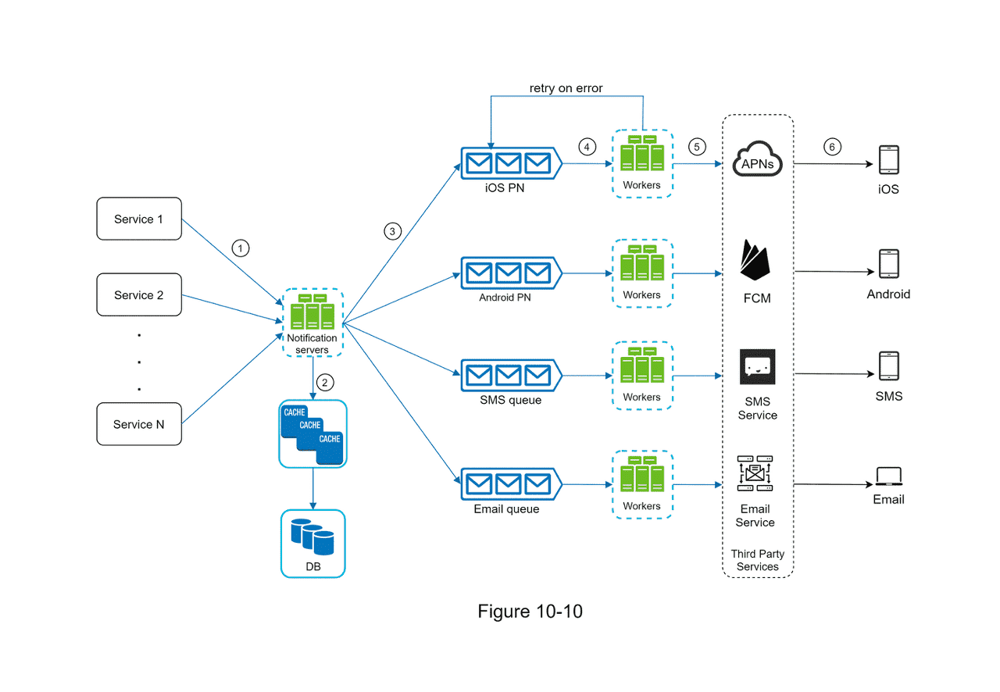

# 5주차 - 10장 알림 시스템 설계

태그: Study
진행도: 완료

<aside>

**알림 시스템은 고객에게 필요한 정보를 비동기적으로 제공하며, 이러한 알림 시스템은 모바일 푸시 알림, SMS 메시지, 이메일로 분류가 된다.**

</aside>

<aside>

**비동기로 구현 하는 이유** 

첫째로, **응답 속도 개선**을 위해서이다. 알림을 동기 처리하면 사용자 요청이 완료되기까지 알림 전송까지 기다려야 하므로 지연이 발생한다. 비동기로 처리한다면, 알림은 백그라운드에서 처리되므로, 메인 작업과 분리가 가능하다.

둘째로, **서비스 안정성 확보**가 가능하다. 알림 서버나 외부 API가 일시적으로 실패해도, RabbitMQ와 같은 비동기 큐를 통해 처리하면 메인 작업에는 영향을 주지 않는다.

셋째, **확장성**이 뛰어나다. 큐에 적재된 알림 요청을 여러 워커가 병렬로 처리할 수 있어 대량 알림도 안정적으로 대응할 수 있습니다.

</aside>

### **알림 유형별 지원 방안**

1. **IOS 푸시 알림**

<aside>

> 구조: 알림 제공자 - APNS - iOS 단말
> 
</aside>

iOS에서 알림을 보내기 위해서는 **알림 제공자(provider)**, **APNS**, **iOS 단말**이 필요하다.

- **알림 제공자(provider)** : 알림 요청을 만들어 애플의 푸시 알림 서비스인 APNS로 보내는 주체이다. 알림을 보낼 때는 알림 요청을 보내는데 필요한 고유 식별자인 **디바이스 토큰(device token)**과 **페이로드(payload)** 데이터가 필요하다.
- **APNS(Apple Push Notification Service)** : 애플이 제공하는 원격 서비스로 푸시 알림을 iOS 장치로 보내는 역할을 한다.
- **iOS 단말** : 푸시 알림을 수신하는 단말이다.

**+) Payload 데이터는 디바이스에 표시될 알림 내용을 JSON 형태로 담은 데이터이다.** 

<aside>
❔

그러면 **FCM** 으로는 iOS 에 푸시 알림을 띄우지 못할까? 

가능하다. 하지만, iOS는 **APNs(Apple Push Notification Service)** 를 통해서만 실제 디바이스에 알림을 띄울 수 있다.

FCM은 내부적으로 i**OS 기기용 FCM 토큰을 APNs로 전달**해서 알림을 보내는 구조이다.
즉, FCM이 APNs를 대신할 수 있는 게 아니라 **APNs를 거쳐야만** iOS 알림이 뜬다.

```java
FCM → 내부적으로 APNs 호출 → iOS 알림 표시
```

</aside>

1. **안드로이드 푸시 알림**

<aside>

> 구조: 알림 제공자 - **FCM** - 안드로이드 단말
> 
</aside>

안드로이드도 iOS와 동일한 구조. 하지만 APN대신 **FCM(Firebase Cloud Messaging)**을 사용한다.

1. **SMS 메시지**

<aside>

> 구조: 알림 제공자 - SMS 서비스 - SMS 수신 단말
> 
</aside>

SMS를 보낼 때는 트윌리오(Twilio), 넥스모(Nexmo)와 같은 제 3사업자의 서비스에 비용을 지불하며 많이 이용한다.

1. **E-mail**

<aside>

> 구조: 알림 제공자 - 이메일 서비스 - 이메일 수신 단말
> 
</aside>

규모가 있는 기업들은 고유 이메일 서버를 구축한다. 하지만 규모가 작은 회사들은 샌드그리드(Sendgrid), 메일침프(Mailchimp)와 같은 상용 이메일 서비스를 이용한다.

### 연락처 정보 수집

알림을 보내려면 모바일 단말 토큰, 전화번호, 이메일 주소 등의 정보가 필요하다.
처음에 앱을 설치하거나 계정을 등록하면 API 서버는 해당 정보를 수집하여 DB에 저장하게 된다.

### 알림 정보 및 수신



- **알림 서버(notification server)** : 서비스에게 알림 전송을 위한 API를 제공해야하고 제 3자 서비스에 전달할 페이로드를 만들며 알림 전송/수신 처리의 핵심 기능을 처리한다. 기능으로는 알림 전송 API, 알림 검증, 데이터베이스와 캐시 조회, 알림 전송의 기능을 제공한다.
    - 알림 전송 API : 스팸 방지를 위해 보통 사내 서비스 또는 인증된 클라이언트만 이용 가능하다.
    - 알림 검증 : 이메일 주소, 전화번호 등에 대한 기본적 검증을 수행한다.
    - 데이터베이스 또는 캐시 조회 : 알림에 포함시킬 데이터를 가져오는 기능이다.
    - 알림 전송 : 알림 데이터를 메시지 큐에 넣는다.  **메시지 큐를 이용해 시스템 컴포넌트 사이의 강한 결합을 끊어낸다.**
- **캐시** : 사용자 정보, 단말 정보, 알림 템플릿 등을 캐시한다.
- **데이터베이스** : 사용자, 알림, 설정 등 다양한 정보를 저장한다.
- **작업 서버 (worker)** : 메시지 큐에서 전송할 알림을 꺼내서 제 3자 서비스로 전달한다.
- **제 3자 서비스(thrid party service)** : 사용자에게 알림을 전달하는 역할을 한다. 제 3자 서비스는 확장성과 시장에서의 사용 가능성이다. 서비스를 새로 통합하거나 제거하는 등의 확장성과 특정 국가들에서 사용할 수 없는 서비스가 있다는 것을 고려해야 한다.

<aside>

**“메시지 큐를 이용해 시스템 컴포넌트 사이의 강한 결합을 끊어낸다.”**

발신자(알림 요청을 보내는 주체)와  수신자(실제 알림을 처리하는 주체) 가 직접 연결되어 있도록 한다.

- 발신자는 "알림 요청"을 메시지 큐에 **넣기만** 하고,
- 수신자는 메시지 큐로부터 "알림 요청"을 **꺼내어** 처리한다.

즉, **서로를 직접 호출하거나 의존할 필요가 없어진다.** 이는 비동기적 구현에 기반한 것으로,  **발신자는 수신자의 IP, 포트, 서버 정보를 알 필요가 없어지고,  수신자는 어떤 발신자가 보냈는지 몰라도 큐에 쌓인 메시지만 보면 된다.

또한, 구조적 독립이 가능하다.**  수신자가 하나가 아니라 여러 개로 늘어나더라도(Worker 다수 배치) 발신자는 아무것도 수정할 필요가 없어지고, 시스템 부하가 늘어난다면 수신자만 늘리면 된다.

**시스템 장애로부터도 자유로워진다.** 수신자가 일시적으로 장애가 나도, 발신자가 영향을 받지 않는다.
큐에 쌓아두었다가, 수신자가 복구되면 다시 처리할 수 있기 때문.

</aside>

### 동작 과정

1. API를 호출하여 알림 서버로 알림을 보낸다.
2. 알림 서버는 사용자 정보, 단말 토큰, 알림 설정 같은 메타데이터를 캐시나 데이터베이스에서 가져온다.
3. 알림 서버는 전송할 알림에 맞는 이벤트를 만들어서 해당 이벤트를 위한 큐에 넣는다.
4. 작업 서버는 메시지 큐에서 알림 이벤트를 꺼낸다.
5. 작업 서버는 알림을 제 3자 서비스로 보낸다.
6. 제 3자 서비스는 사용자 단말로 알림을 전송한다.

### 서비스 구체화

다른 서비스들과 같이 분산 환경에서 운영되는 서비스는 안정성을 확보하기 위해 고려할 사항들이 존재한다.

**데이터 손실 방지** : 알림 시스템의 요구사항에서 알림이 소실되면 안된다는 점이 중요하다면 알림 시스템에서 메시지 큐의 내용을 제 3자 서비스로 전달하는 작업 서버에 알림 관련 데이터를 저장하는 데이터베이스에 보관하고 재시도하는 메커니즘을 구현할 수 있다.

**알림 중복 전송 방지** : 같은 알림이 여러 번 반복되는 것을 완전히 막는 것은 불가능하지만 빈도를 줄이려면 중복을 탐지하는 메커니즘을 도입하고 오류를 신중하게 처리해야 한다. 해당 메커니즘은 작업 서버가 이벤트 ID를 검사하며 이전에 처리하지 않은 이벤트만 처리하는 방법 등이 있다.

### 컴포넌트

**알림 템플릿**

- 알림 메시지의 대부분은 형식이 비슷하다는 점을 고려하여,  알림 메시지의 모든 부분을 처음부터 만들지 않도록 알림 템플릿을 제공할 수 있다. 알림 템플릿은 인자(parameter)나 스타일, 추적 링크(tracking link)를 조정하기만 하면 사전에 지정한 형식에 맞는 알림을 만들어낼 수 있다.
- 알림 템플릿을 사용하면 알림들의 형식을 일관성있게 유지하고 오류의 가능성과 알림 작성 비용을 줄여준다.
- ex) 지금 [item_name]을 주문하세요.

**알림 설정**

- 사용자가 알림 설정을 상세히 조절할 수 있도록 제공할 수 있다.
- 해당 정보는 알림 설정 테이블에 보관된다.

**전송률 제한**

- 한 사용자가 받을 수 있는 알림의 빈도를 제한하여 사용자가 너무 많은 알림을 받지 않도록 할 수 있다.

**재시도 방법**

- 제 3자 서비스가 알림 전송에 실패하면 해당 알림을 재시도 전용 큐에 넣어 재시도를 할 수 있다.
- 만약 같은 문제가 계속해서 발생하면 개발자에게 통지한다.

**푸시 알림과 보안**

- iOS 와 안드로이드 앱의 알림 전송 API는 appKey와 appSecret을 사용하여 인증된 클라이언트만 API를 사용할 수 있다.

**큐 모니터링**

- 큐에 쌓인 메트릭(metric)을 확인하며 작업 서버들이 이벤트들을 잘 처리하고 있는지 확인하며 서버를 증설할지 유지할지, 줄일지에 대한 결정을 할 수 있다.

**이벤트 추적**

- 알림 시스템은 보통 데이터 분석 서비스와 통합하여 이벤트 추적을 통해 알림이 만들어진 후 성공적으로 전송되기까지의 과정을 추적한다.