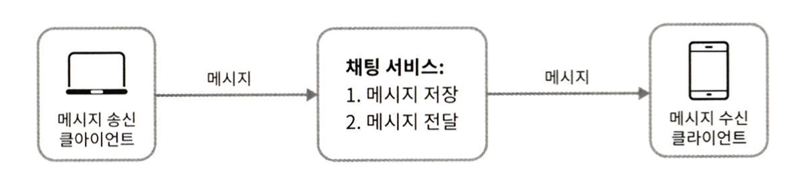

# 5주차 - 12장 채팅 시스템 설계

태그: Study
진행도: 진행중

클라이언트는 서로 직접 통신하지 않고, 각 클라이언트는 채팅 서비스와 통신한다. 
채팅 서비스는 아래 기능을 제공해야 한다.

- 클라이언트로부터 메시지 수신
- 메시지 수신자(recipient) 결정 및 전달
- 수신자가 접속 상태가 아닌 경우, 접속할 때까지 해당 메시지 보관

- 채팅을 시작하려는 클라이언트는 네트워크 통신 프로토콜을 이용하여 서비스에 접속한다.
- 송신 클라이언트는 수신 클라이언트에게 전달할 메시지를 채팅 서비스를 보낼 떄, 검증된 HTTP 프로토콜을 사용한다.
- 채팅 서비스와의 접속에는 **keep-alive 헤더**를 사용하면 효율적(클라이언트와 서버 사이의 연결을 끊지 않고 계속 유지할 수 있어서 & TCP 접속 과정에서 발생하는 핸드쉐이크 횟수를 줄일 수 있음)
- BUT HTTP는 클라이언트가 연결을 만드는 프로토콜이며, 서버에서 클라이언트로 임의 시점에 보내는데는 쉽게 쓰일 수 없음. 서버가 연결을 만드는 것처럼 동작할 수 있도록 개발하는 기법? 
EX) 폴링(polling), 롱 폴링(long poll-ing), 웹소켓(WebSocket)

<aside>

1. **폴링(Polling)**

클라이언트가 주기적으로 서버에게 새 메시지가 있는지 물어보는 방법으로, 폴링 비용은 폴링을 자주하면 할수록 올라감.

따라서, 답해줄 메시지가 없는 경우 **서버 자원이 불필요하게 낭비**된다는 문제가 존재한다. 

1. **롱 폴링 (Long Poll-ing)** 

롱 폴링의 경우, 클라이언트는 새 메시지가 반환되거나 타임아웃 될때까지 연결이 유지 된다.
클라이언트는 새 메시지를 받으면 기존 연결을 종료하고, 서버에 새로운 요청을 보내어 모든 절차 다시 시작.

**취약점**

- **메시지를 보내는 클라이언트와 수신하는 클라이언트가 같은 채팅 서버에 접속하게 되지 않을 수 있음.** Http 서버는 보통 무상태(stateless) 서버이기에,  로드 밸런싱을 위해 라운드 로빈(round robin) 알고리즘을 사용하는 경우, 메시지를 받은 서버는 해당 메시지를 수신할 클라이언트와의 롱 폴링 연결을 가지고 있지 않은 서버일 수 있음.
- 서버 입장에서 클라이언트가 연결을 해체했는지 아닌지 알 수 없음.
- 타임 아웃이 일어날때마다, 주기적으로 서버에 다시 접속할 것임
</aside>

### 웹 소켓 (Web Socket)

웹소켓(Websocket)은 서버가 클라이언트에게 비동기(async) 메시지를 보낼때 사용되는 기술이다.

<aside>

- 웹소켓 연결은 클라이언트가 시작함. 한번 맺어진 연결은 양방향이다. 처음 연결은 HTTP 연결이지만 특정 핸드셰이크 절차를 거쳐 웹소켓 연결로 됨.
- 서버는 클라이언트에게 비동기적으로 메시지 전송 가능
- **웹 소켓은 일반적으로 방화벽이 있는 환경에서도 잘 동작 ( 80, 443처럼 HTTP, HTTPS 프로토콜이 사용하는 기본 포트번호를 그대로 쓰기 때문이다.)**
</aside>

<aside>

**SPOF 방지를 위한 채팅 트래픽의 분산 처리** 

- 채팅 서버는 클라이언트 사이에 메시지를 중계하는 역할을 담당한다.
- 접속상태 서버(presence server)는 사용자의 접속 여부를 관리한다.
- API 서버는 로그인, 회원가입, 프로파일 변경 등 그 외 나머지 전부를 처리한다.
- 알림 서버는 푸시 알림을 보낸다.
- 키-값 저장소(key-value store)는 채팅 이력(chat history)를 보관한다.
</aside>

<aside>

**채팅 데이터 저장소** 

1. **사용자 프로파일, 설정, 친구 목록처럼 일반적인 데이터**

→ 이런 데이터는 안정성을 보장하기 위해 **관계형 데이터베이스에 저장(다중화, 샤딩기법)**

1. **채팅 시스템 고유 데이터(채팅 이력)**

채팅 이력 데이터의 양은 엄청나다. 주로 최근 주고받은 메시지가 빈번하게 사용되고, 
검색 기능, 특정 사용자가 언급(mention)된 메시지를 보거나, 특정 메시지로 점프(jump)하거나 하여 무작위적인 데이터 접근을 하게 되는 일도 있음. 1:1 채팅 앱의 경우 읽기:쓰기 비율은 대략 1:1이다.

1. **데이터는 키-값 저장소를 추천함.**

키-값 저장소는 수평적 규모 확장이 쉽고, 데이터 접근 지연시간(latency)이 낮다.
RDBMS 의 경우 는 롱 테일에 해당하는 부분을 잘 처리하지 못하는 경향이 있고, 인덱스가 커지면 데이터에 대한 무작위 접근(random access)을 처리하는 비용이 늘어남
(페이스북 메신저는 HBase를 사용, 디스코드는 카산드라(Cassandra)를 이용한다고 함)

</aside>

<aside>

**테이블 설계**

**1. 1:1 채팅을 위한 메시지 테이블**

created_at을 사용하여 메시지 순서를 정할 수 없음, 서로 다른 두 메시지가 동시에 만들어질 수 있기 때문이다.

**2. 그룹 채팅을 위한 메시지 테이블**

(channel_id, message_id)의 복합 키(composite key)를 기본 키로 사용한다. 
채널(channel)은 채팅 그룹과 같은 뜻이고, channel_id는 파티션 키로 지정한다. 

**메시지 ID**

- message_id의 값은 유일 해야 함.
- ID 값은 정렬 가능해야 하며, 시간 순서와 일치해야 한다. 즉 새로운 id는 이전 id보다 큰 값.

RDBMS의 경우 auto_increment가 대안, but NoSQL은 해당 기능 제공X

**NoSQL 에서 순서 보장이 필요한 경우, 대표적인 대안들** 
- 스노플레이크 같은 전역적 64-BIT 순서 번호 생성기를 이용
- 지역적 순서 번호 생성기(local sequence number generator)를 이용

(메시지 사이의 순서는 같은 채널, 혹은 같은 1:1 채팅 세션 안에서만 유지되면 충분하기 때문)

</aside>